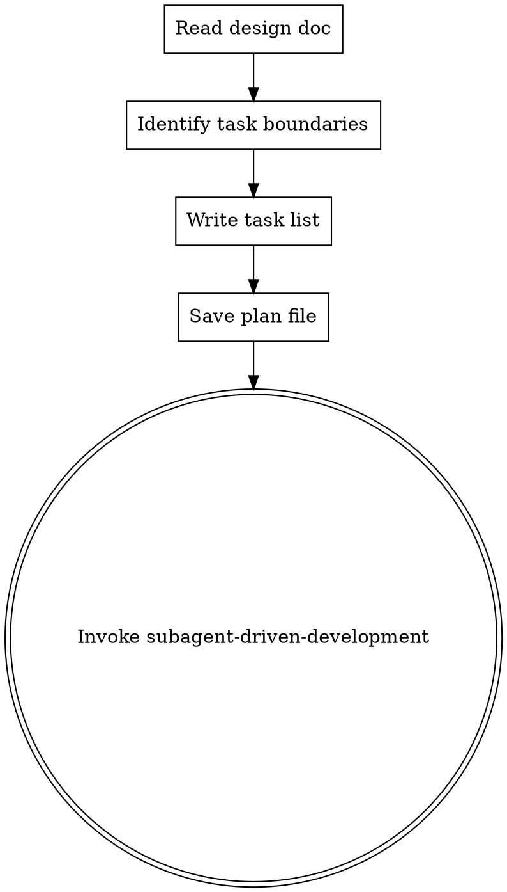

# Writing Implementation Plans

## Overview

Convert an approved design document into a concrete, ordered implementation plan, then dispatch execution via `subagent-driven-development`.

**Announce at start:** "I'm using the writing-plans skill to create an implementation plan."

## When to Use

- brainstorming design has been approved by Yuan
- need to break down the design into atomic tasks for execution
- preparing to invoke `subagent-driven-development` for implementation

## Process Flow



## Steps

### 1. Read Design Document

Read the design doc produced by brainstorming:

```
docs/plans/YYYY-MM-DD-<topic>-design.md
```

Extract:
- Feature goals and acceptance criteria
- Modules involved (`blog-module-*`, `blog-infrastructure`, `blog-common`)
- Architectural decisions (Facade boundaries, domain model changes, API contracts)

### 2. Identify Task Boundaries

Split the design into atomic tasks following these rules:

- **One responsibility per task** — a task touches one layer (Controller / Service / Repository / Domain Model) in one module
- **Respect module boundaries** — cross-module interactions must go through a Facade interface; each Facade change is its own task
- **Honour dependency order** — if Task B depends on Task A's output, Task A comes first
- **TDD required** — every task that adds or changes implementation code must include writing a failing test before the implementation

### 3. Write Task List

For each task, specify:

| Field | Content |
|-------|---------|
| **目標模組** | `blog-module-user` / `blog-module-article` / `blog-infrastructure` / `blog-common` |
| **責任層** | Service / Repository / Controller / DomainModel / Facade / Config / DTO |
| **目標** | 用一句話描述這個任務要完成什麼 |
| **TDD 要求** | 先寫失敗測試，確認 Red，再寫實作，確認 Green，再 Refactor |
| **相依任務** | 列出必須先完成的任務編號（若無則填「無」） |
| **驗證指令** | `./mvnw test -pl <module> -am --no-transfer-progress` |

### 4. Save Plan File

Write the plan to:

```
docs/plans/YYYY-MM-DD-<topic>-implementation-plan.md
```

Plan file format:

```markdown
# Implementation Plan: <topic>

## Design Reference
- Design doc: `docs/plans/YYYY-MM-DD-<topic>-design.md`
- Approved by: Yuan

## Tasks

### Task 1 — <目標模組>/<責任層>: <目標>
- **TDD**: 先寫 `<TestClass>#<testMethod>` 確認 Red，再實作
- **相依**: 無
- **驗證**: `./mvnw test -pl <module> -am --no-transfer-progress  -T 2C`

### Task 2 — ...
```

### 5. Invoke `subagent-driven-development`

呼叫 `subagent-driven-development` skill，以計畫內容分發執行。

## Project-Specific Conventions

This is a Java Spring Boot Maven project. Every task must comply with:

| Convention | Rule |
|-----------|------|
| **TDD** | 每個實作任務必須先寫失敗測試（Red），再寫最少實作（Green），再重構（Refactor） |
| **Facade** | 跨模組相依透過 Facade 介面（定義於 `blog-infrastructure`，實作於對應模組） |
| **JavaDoc** | 所有類別與公開方法必須有繁體中文 JavaDoc（含 Description、Author、Version、@param、@return） |
| **Test command** | `./mvnw test -pl <module> -am --no-transfer-progress` |
| **IT tests** | `*IT.java` 需在 pom.xml surefire 加 `<includes>` 才會執行 |
| **Security** | ECDSA ES256 JWT；Redis token version 驗證 |

## Common Mistakes

### Tasks too large

- **Problem:** A task covers multiple layers — hard to test atomically
- **Fix:** Split by layer; each task touches exactly one layer

### Missing Facade task

- **Problem:** Two modules communicate directly via Repository
- **Fix:** Add a Facade interface task and an implementation task before any cross-module consumer task

### No TDD annotation

- **Problem:** Implementation written before test
- **Fix:** Every task description must state which test class/method to write first
